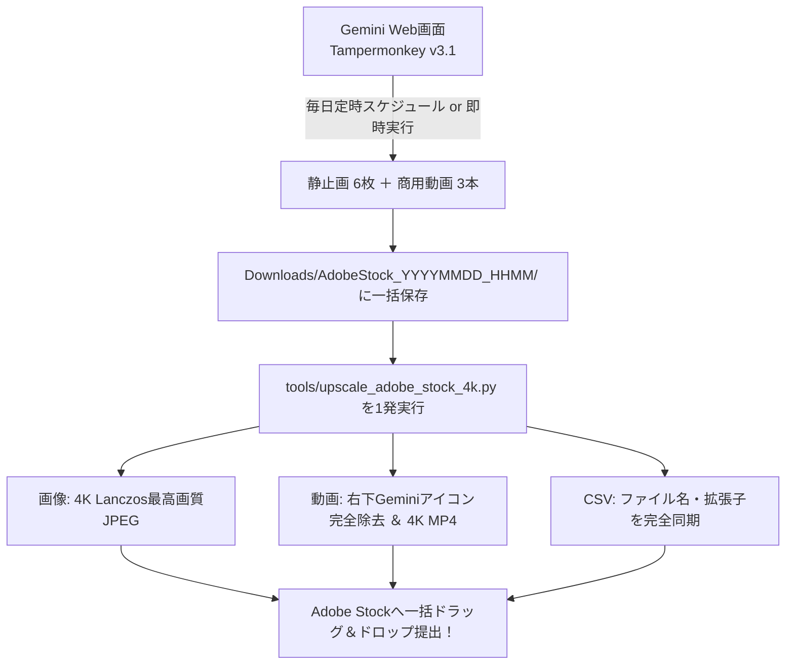

# Adobe Stock 統合マスター仕様書 (Adobe Stock Master Rules)

本ドキュメントは、**Adobe Stockにおける静止画（4K最高画質）・商用動画（4K/60fps 3Dループ & シネマティック動画）・CSVメタデータ出品**の全仕様・運用手順を完全集約したマスター仕様書です。

---

## 1. 制作パイプライン（Web版Gemini & 4K化ワークフロー）



---

## 2. 確定仕様 & 制作規格まとめ

### ① 生成エンジン & デイリー黄金配分
* **生成エンジン**: Web版Gemini（Google AI Pro / Imagen 3 / Omni）
* **デイリー黄金配分（週60件枠＆利用枠20%に最適化）**:
  * **静止画 6枚**: コスメ、建築、金融、バイオ、スマート工場、環境建築（コピースペース付き）
  * **商用動画 3本**: 水面ポディウム、モダン建築の光と影、朝焼け役員室スカイライン（シネマティックカメラワーク）
* **自動化ツール**:
  * `tools/gemini_auto_stock_generator.user.js`（Tampermonkeyスクリプト）

### ② 画像・動画の4K化 ＆ 透かし完全消去（Macローカル処理）
* **静止画**:
  * 高品質Lanczos補間により、**4K UHD (3840×2160) 最高画質JPEG** へ拡大。
* **動画（右下Geminiアイコンの完全除去）**:
  * `ffmpeg` を使用し、16:9アスペクト比を完全維持した **「スマート画角調整（86%微小クロップ）＋ 4K Lanczosスケール」** を適用。
  * 透かしを100%物理的に画面外へ排除。
  * ストック動画の審査基準である無音（`-an`）処理を自動適用。
* **実行スクリプト**:
  ```bash
  python3 tools/upscale_adobe_stock_4k.py
  ```

### ③ 出品メタデータ：公式規定準拠CSV（`adobe_stock_submission.csv`）
* **自動同期**: 生成時に作成されるCSVに対し、スクリプト実行で拡張子（`.jpg` / `.mp4`）が自動同期。
* **提出時設定**: 「生成AI: はい」「人物・プロパティは架空: チェック」

---

## 3. 3Dループ動画素材（Blender / Jelly Slicer）規格

1. **3Dアニメーション素材のAdobe Stock出品**:
   - Blenderで制作した幾何学ループ、プロシージャル切断/衝突、Oddly Satisfying、メカニカル構造を商用ループ動画素材（4K/60fps / B-roll）として出品。
2. **エンコード規格**:
   - 解像度: `3840x2160` (4K UHD) または `1920x1080` (Full HD)
   - フレームレート: `60 fps`
   - コーデック: Apple ProRes 422 または H.264
   - ループ性: **100%完全シームレスループ（Seamless Loop）**
3. **カメラモーション**:
   - 手ブレのない安定した三脚固定・スムーズなパン。
